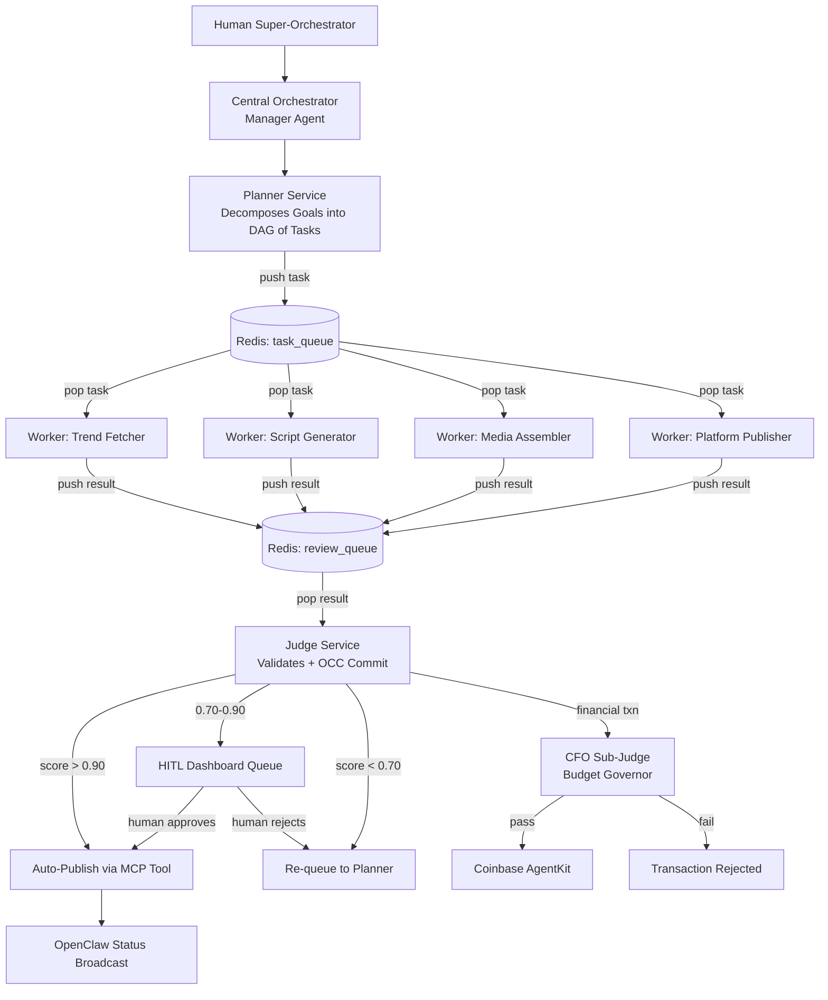
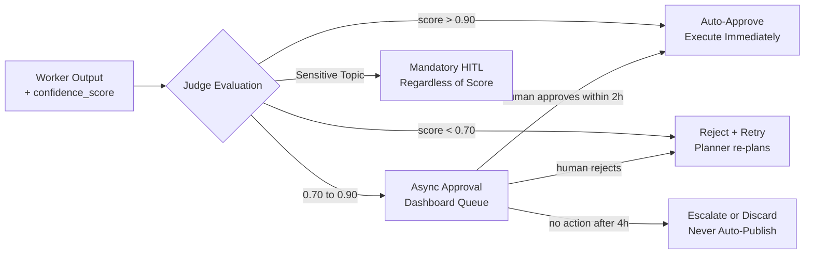
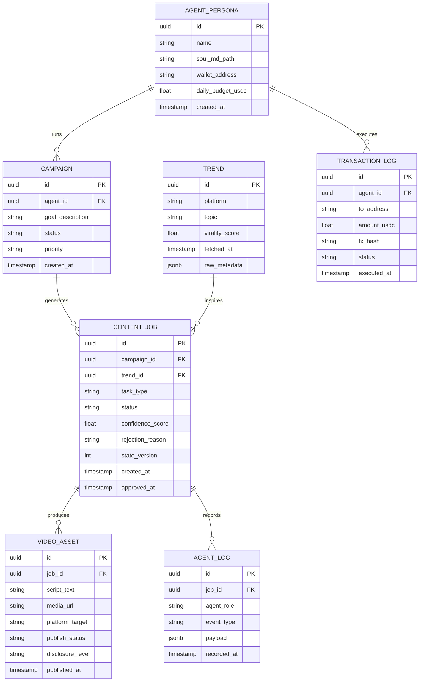
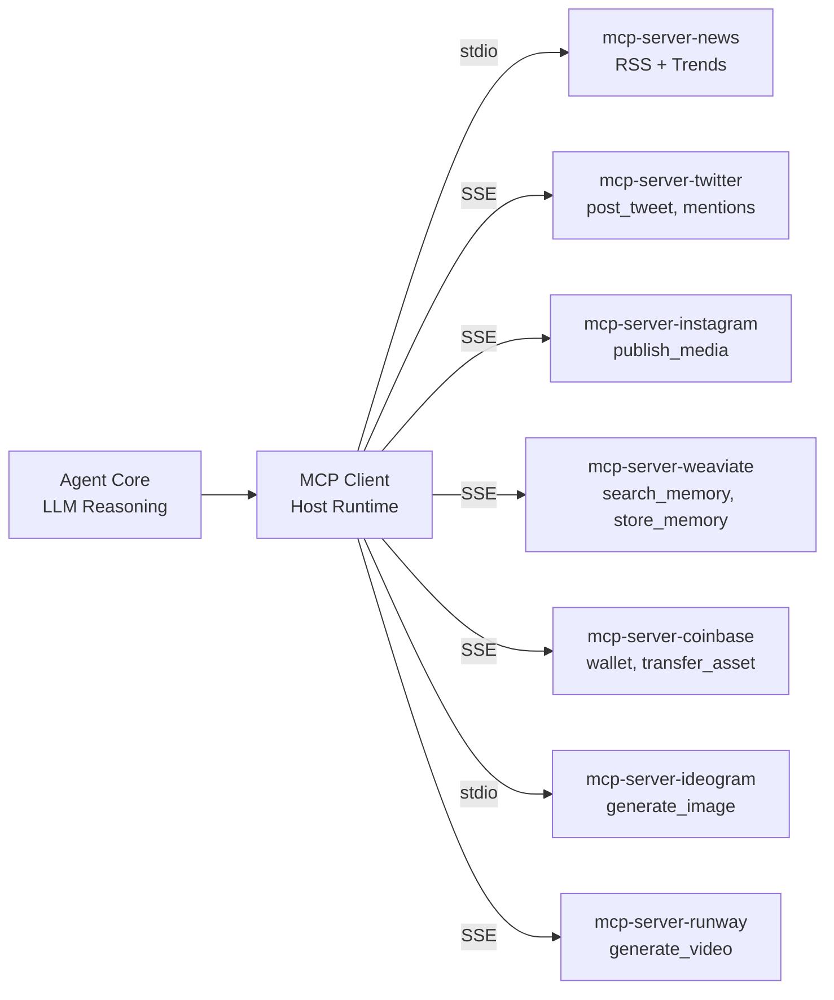

# Project Chimera — Architecture Strategy
> **Author:** Forward Deployed Engineer  
> **Date:** 2026-03-21  
> **Status:** Ratified (Day 1 Deliverable)  
> **References:** SRS v2026, a16z Trillion Dollar AI Stack, OpenClaw/TechCrunch, The Conversation

---

## 1. Research Summary & Key Insights

### 1.1 The Trillion Dollar AI Dev Stack (a16z)

The a16z article establishes the foundational philosophy underpinning this entire project.
The most critical insight is the emergence of **Spec-Driven Development** as the dominant
paradigm in AI-assisted engineering. It describes a **Plan → Code → Review** loop where
specifications are not merely documentation but *executable intent* that governs agent
behaviour. Crucially, specifications serve a dual purpose: guiding initial code generation
AND ensuring long-term comprehension by both humans and LLMs in large codebases.

A second key insight is the distinction between **developer tools** (MCP servers used during
development — git, filesystem, code search) and **agent runtime tools** (skills used at
execution time — downloading content, transcribing audio, posting to social platforms).
This maps directly to Chimera's architecture, where these two layers must be cleanly
separated.

Finally, the article validates the use of **Background Agents** — systems operating over
extended periods without direct user interaction, using automated tests to verify
correctness. This is exactly the Chimera execution model: Planner/Worker/Judge swarms
running asynchronously with Redis as the coordination backbone.

### 1.2 OpenClaw & The Agent Social Network (TechCrunch)

OpenClaw reveals that autonomous agents are already self-organising into social networks
without human orchestration. The critical architectural takeaways are:

- **Skill Files as Social Protocol:** OpenClaw agents communicate via downloadable
  instruction files ("skills") that define how an agent interacts with the network. Chimera
  must adopt an identical pattern — skills are the lingua franca of the agent ecosystem.
- **Submolts = Agent Forums:** Agents post to topic-specific channels and poll for updates
  on a schedule. Chimera's OpenClaw integration must implement a publish/subscribe
  mechanism aligned with this model.
- **Security is Unsolved:** The "fetch and follow instructions from the internet" model
  carries inherent prompt injection risks. Chimera must implement a Human-in-the-Loop
  safety gate before any agent-generated content is published publicly.
- **The 4-Hour Polling Cycle:** Agents check for updates every 4 hours — this directly
  informs Chimera's Trend Spotter scheduler design (confirmed by SRS §4.2 FR 2.2).

### 1.3 OpenClaw & MoltBook — Historical Context (The Conversation)

The academic framing reinforces that agent social networks are a predictable evolutionary
step. Key implication for Chimera: **inter-agent communication protocols must be treated
as first-class concerns**, not afterthoughts. Social protocols go beyond HTTP requests —
they include identity, reputation, intent signalling, and structured message formats. This
directly informs the `specs/openclaw_integration.md` bonus spec.

### 1.4 Project Chimera SRS Document (Primary Reference)

The SRS defines the system as an **Autonomous Influencer Network** built on two
breakthrough architectural patterns:

1. **Model Context Protocol (MCP)** — universal, standardised connectivity to the external
   world. The agent core never calls third-party APIs directly; all external interaction flows
   through MCP Servers.
2. **FastRender Swarm Architecture** — Planner/Worker/Judge roles for internal task
   coordination, parallelism, and quality control with Optimistic Concurrency Control.

Additional SRS insights shaping this strategy:
- **Fractal Orchestration:** A single human Super-Orchestrator → AI Manager Agents →
  Worker Swarms. Management by Exception only.
- **SOUL.md:** Each agent's persona is defined by a version-controlled markdown file,
  enabling GitOps management of agent personalities.
- **Agentic Commerce:** Coinbase AgentKit gives each agent a non-custodial crypto
  wallet. A specialised "CFO" Judge sub-agent governs all financial transactions.
- **Hierarchical Memory:** Redis (short-term/episodic 1h window) + Weaviate
  (long-term/semantic RAG) + PostgreSQL (transactional).
- **Confidence-Scored HITL:** Judge routes outputs dynamically — >0.90 auto-approve,
  0.70–0.90 async human review, <0.70 auto-reject/retry.

---

## 2. How Project Chimera Fits into the OpenClaw / Agent Social Network

Project Chimera is not a standalone AI influencer — it is a **node in a broader agent
ecosystem**. Its role in the OpenClaw network:

| Role | Description |
|---|---|
| **Content Producer** | Researches trends, generates multimodal content, publishes it |
| **Status Broadcaster** | Publishes availability, current task, and quality scores to the network |
| **Skill Consumer** | Downloads and executes skill files from the OpenClaw Submolt ecosystem |
| **Reputation Participant** | Other agents can rate Chimera's content, influencing scheduling priority |
| **Economic Agent** | Transacts on-chain via Coinbase AgentKit — pays for resources, receives revenue |

**Social Protocols Chimera must implement:**

1. **Availability Signal** — Structured JSON heartbeat published to OpenClaw declaring
   agent status (`IDLE`, `RESEARCHING`, `GENERATING`, `AWAITING_APPROVAL`).
2. **Content Manifest** — Machine-readable description of produced content (topic,
   format, target platform, confidence score) for other agents to reference or remix.
3. **Skill Handshake** — Before executing a downloaded skill, Chimera verifies its
   signature against a trusted registry (mitigates prompt injection per OpenClaw security
   best practices).
4. **Error Broadcast** — On task failure, Chimera publishes a structured error report to
   the network so orchestrators can re-route work.

---

## 3. Agent Pattern Selection

### Decision: FastRender Hierarchical Swarm (SRS §3.1 — Mandated)



**Pattern comparison:**

| Pattern | Verdict | Reason |
|---|---|---|
| Sequential Chain | ❌ Rejected | Brittle — one failed Worker blocks entire pipeline. No parallelism. |
| Flat Parallel Swarm | ⚠️ Partial | Fast, but no coordination layer. Workers cannot share context. |
| **FastRender Hierarchical Swarm** | ✅ Selected (SRS mandated) | Planner coordinates; Judge validates with OCC; scales to 1,000+ agents via Java 21 Virtual Threads |

### Agent Roles

| Agent | Responsibility | Concurrency Model |
|---|---|---|
| **Orchestrator / Manager** | Fleet-level strategy, resource allocation, dashboard | Singleton coordinating thread |
| **Planner Service** | Decomposes campaign goals into DAG of Tasks; pushes to `task_queue` | Single reactive thread per campaign |
| **Trend Fetcher Worker** | Polls MCP Resources (Twitter, YouTube, Google Trends) every 4h | Virtual Thread per request |
| **Script Generator Worker** | Produces video scripts via LLM (Claude Opus / Gemini 3 Pro) | Virtual Thread per script |
| **Media Assembler Worker** | Downloads assets, assembles video (Runway/Luma via MCP Tools) | Virtual Thread per job |
| **Platform Publisher Worker** | Publishes via MCP Tools (`twitter.post_tweet`, `instagram.publish_media`) | Virtual Thread per platform |
| **Judge Service** | Validates output; routes by confidence score; OCC commit to GlobalState | Synchronous — blocking gate |
| **CFO Sub-Judge** | Budget governance; validates all Coinbase AgentKit transactions | Synchronous — financial gate |

---

## 4. Human-in-the-Loop Design (SRS §5.1 NFR 1.0–1.2)



**Sensitive Topic Filters** — mandatory HITL regardless of confidence score:
Politics, Health Advice, Financial Advice, Legal Claims.  
Detected via keyword matching + semantic classification using a lightweight LLM.

**Human Review SLA:** Reviewers must action items within 2 hours. After 4 hours without
action, items are escalated or discarded — never auto-published.

---

## 5. Database Architecture Decision

### Decision: Four-Layer Persistence (SRS §2.3)

| Layer | Technology | Purpose |
|---|---|---|
| **Semantic Memory** | Weaviate (Vector DB) | Agent memories, persona definitions, world knowledge; long-term RAG retrieval |
| **Transactional Data** | PostgreSQL 16 | User accounts, campaign configs, operational logs, video metadata |
| **Episodic Cache + Queue** | Redis 7 + Redis Streams | Short-term memory (1h window), `task_queue`, `review_queue`, daily spend tracking |
| **Financial Ledger** | On-chain (Base / Ethereum) | Immutable record of all agent financial transactions via Coinbase AgentKit |

### Core ERD



---

## 6. Java 21+ Infrastructure Decisions

### Virtual Threads for Worker Concurrency

Chimera's Workers are I/O-bound (LLM API calls, media downloads, social platform posts).
Java 21 Virtual Threads are purpose-built for this profile. The SRS requires supporting
1,000+ concurrent agents (NFR 3.0) — Virtual Threads make this tractable without a
massive OS thread pool.

```java
// Orchestrator spawning Workers concurrently via Virtual Thread Executor
try (var executor = Executors.newVirtualThreadPerTaskExecutor()) {
    Future<TrendData>  trendFuture  = executor.submit(trendFetcherWorker::execute);
    Future<ScriptData> scriptFuture = executor.submit(scriptGeneratorWorker::execute);
    Future<MediaData>  mediaFuture  = executor.submit(mediaAssemblerWorker::execute);
    // All Workers execute concurrently — zero blocking OS threads
}
```

### Java Records for Immutable DTOs (SRS §7.1 Genesis Prompt)

All data transfer between Planner, Workers, and Judge uses Java Records — immutable
by construction, thread-safe, no defensive copying required.

```java
// Core DTOs — strict, immutable Java Records
public record AgentTask(
    UUID taskId,
    String taskType,           // "generate_content" | "reply_comment" | "execute_transaction"
    String priority,           // "high" | "medium" | "low"
    TaskContext context,
    String assignedWorkerId,
    Instant createdAt,
    String status
) {}

public record TaskContext(
    String goalDescription,
    List<String> personaConstraints,
    List<String> requiredResources   // MCP resource URIs e.g. "mcp://twitter/mentions/123"
) {}

public record AgentResult(
    UUID taskId,
    UUID workerId,
    boolean success,
    float confidenceScore,           // 0.0 – 1.0 for HITL routing
    String payload,
    int stateVersion                 // for OCC validation
) {}
```

### Optimistic Concurrency Control (OCC — SRS §3.1.3 & §6.1)

When the Judge attempts to commit a Worker's result to GlobalState, it checks
`state_version`. If state has drifted (e.g., campaign paused, budget exhausted), the
commit fails and the task is re-queued. This prevents "ghost updates."

```java
if (result.stateVersion() != globalState.currentVersion()) {
    planner.requeue(result.taskId(), "state_drift");
    return CommitResult.INVALIDATED;
}
globalState.commit(result, globalState.currentVersion() + 1);
return CommitResult.APPROVED;
```

### MCP Integration Architecture (SRS §3.2)



**Prime Directive:** The Agent Core **never** calls third-party APIs directly.
All external interaction flows through MCP Servers (SRS §4.4 FR 4.0 — strictly enforced).

---

## 7. Skills vs. MCP Servers — Separation of Concerns

| Category | Definition | Examples | Location |
|---|---|---|---|
| **Dev MCP Servers** | Tools that help *developers* build Chimera | `git-mcp`, `filesystem-mcp`, `sqlite-mcp` | `research/tooling_strategy.md` |
| **Runtime MCP Servers** | External bridges used by agents at runtime | `mcp-server-twitter`, `mcp-server-coinbase`, `mcp-server-weaviate` | `specs/technical.md` |
| **Agent Skills** | Reusable capability packages orchestrating MCP Tool calls | `skill_fetch_trends`, `skill_transcribe_audio`, `skill_post_content` | `skills/` directory |

Skills are higher-level than raw MCP Tools — they encapsulate retry logic, budget checks,
persona constraint validation, and OCC version tracking.

---

## 8. Summary of All Key Decisions

| Dimension | Decision | Source |
|---|---|---|
| Agent Pattern | FastRender Hierarchical Swarm (Planner/Worker/Judge) | SRS §3.1 |
| Human-in-the-Loop | Confidence-scored: >0.90 auto, 0.70–0.90 async, <0.70 retry | SRS §5.1 |
| Primary Database | PostgreSQL 16 (transactional data) | SRS §2.3 |
| Memory Layer | Weaviate (semantic) + Redis (episodic/queue) | SRS §2.3 |
| Financial Ledger | On-chain via Coinbase AgentKit + CFO Judge guardrail | SRS §4.5 |
| Java Concurrency | Virtual Threads (`newVirtualThreadPerTaskExecutor`) | SRS + Java 21 |
| DTO Design | Java Records (immutable, OCC-compatible) | SRS §7.1 |
| External Integration | MCP-only — zero direct API calls from agent core | SRS §4.4 FR 4.0 |
| Persona Management | SOUL.md (version-controlled markdown + YAML frontmatter) | SRS §4.1 FR 1.0 |
| OpenClaw Integration | Heartbeat + Content Manifest + Skill Handshake + Error Broadcast | SRS + TechCrunch |

---

*This document is the source of truth for all architectural decisions in Project Chimera.  
Any deviation must be reflected here before implementation begins.*
