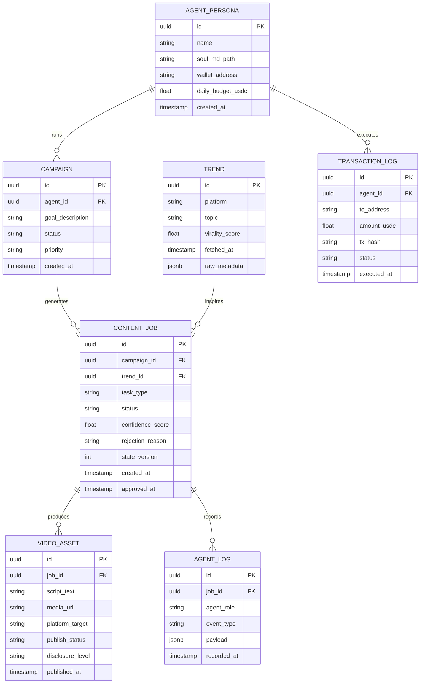

# Project Chimera — Technical Specification
> **Version:** 1.0.0  
> **Status:** Ratified  
> **Source:** SRS v2026 §6.2, §3

---

## 1. Java Record DTOs

All data transfer between Planner, Workers, and Judge MUST use Java Records.
No mutable POJOs or generic Maps for agent payloads.

```java
// --- Core Task DTO (matches SRS §6.2 Schema 1) ---
public record AgentTask(
    UUID taskId,
    String taskType,           // "generate_content" | "reply_comment" | "execute_transaction"
    String priority,           // "high" | "medium" | "low"
    TaskContext context,
    String assignedWorkerId,
    Instant createdAt,
    String status              // "pending" | "in_progress" | "review" | "complete"
) {}

public record TaskContext(
    String goalDescription,
    List<String> personaConstraints,
    List<String> requiredResources  // e.g. ["mcp://twitter/mentions/123"]
) {}

// --- Worker Result DTO ---
public record AgentResult(
    UUID taskId,
    UUID workerId,
    boolean success,
    float confidenceScore,     // 0.0 – 1.0
    String payload,            // JSON string of generated content
    int stateVersion           // OCC version at time of task start
) {}

// --- Trend Data DTO ---
public record TrendData(
    String platform,
    String topic,
    float viralityScore,
    Instant fetchedAt,
    Map<String, Object> rawMetadata
) {}

// --- Persona DTO (from SOUL.md) ---
public record AgentPersona(
    UUID id,
    String name,
    List<String> voiceTraits,
    List<String> directives,
    String backstory,
    String characterReferenceId
) {}

// --- Commerce DTO ---
public record TransactionRequest(
    UUID agentId,
    String toAddress,
    float amountUsdc,
    String reason,
    int stateVersion
) {}
```

---

## 2. API Contracts (JSON)

### POST /api/tasks — Create Task
**Request:**
```json
{
  "task_type": "generate_content",
  "priority": "high",
  "context": {
    "goal_description": "Create a TikTok video about trending Ethiopian fashion",
    "persona_constraints": ["Gen-Z tone", "No politics"],
    "required_resources": [
      "mcp://news/ethiopia/fashion/latest",
      "mcp://memory/agent-001/recent"
    ]
  }
}
```
**Response `201`:**
```json
{
  "task_id": "550e8400-e29b-41d4-a716-446655440000",
  "status": "pending",
  "assigned_worker_id": null,
  "created_at": "2026-03-21T10:00:00Z"
}
```

---

### GET /api/tasks/{taskId}/status
**Response `200`:**
```json
{
  "task_id": "550e8400-e29b-41d4-a716-446655440000",
  "status": "review",
  "confidence_score": 0.82,
  "hitl_required": true,
  "hitl_reason": "medium_confidence",
  "state_version": 7
}
```

---

### POST /api/judge/review — Submit Judge Decision
**Request:**
```json
{
  "task_id": "550e8400-e29b-41d4-a716-446655440000",
  "decision": "APPROVE",
  "reviewer_id": "human-reviewer-001",
  "notes": "Looks good, approved for publish"
}
```
**Response `200`:**
```json
{
  "task_id": "550e8400-e29b-41d4-a716-446655440000",
  "committed": true,
  "new_state_version": 8
}
```

---

### POST /api/commerce/transact — Request On-Chain Transaction
**Request:**
```json
{
  "agent_id": "agent-001",
  "to_address": "0xABC123...",
  "amount_usdc": 5.00,
  "reason": "Pay for image generation",
  "state_version": 7
}
```
**Response `200` (CFO approved):**
```json
{
  "approved": true,
  "tx_hash": "0xDEF456...",
  "daily_spend_remaining": 45.00
}
```
**Response `403` (CFO rejected):**
```json
{
  "approved": false,
  "reason": "BudgetExceededException: daily limit $50 USDC would be exceeded",
  "daily_spend_remaining": 2.50
}
```

---

### MCP Tool Definition — post_content (SRS §6.2 Schema 2)
```json
{
  "name": "post_content",
  "description": "Publishes text and media to a connected social platform.",
  "inputSchema": {
    "type": "object",
    "properties": {
      "platform": {
        "type": "string",
        "enum": ["twitter", "instagram", "threads"]
      },
      "text_content": {
        "type": "string",
        "description": "Body of the post."
      },
      "media_urls": {
        "type": "array",
        "items": { "type": "string" }
      },
      "disclosure_level": {
        "type": "string",
        "enum": ["automated", "assisted", "none"]
      },
      "character_reference_id": {
        "type": "string",
        "description": "Enforces visual character consistency (FR 3.1)."
      }
    },
    "required": ["platform", "text_content", "disclosure_level"]
  }
}
```

---

## 3. Database Schema (ERD)



---

## 4. Redis Key Schema

| Key Pattern | Type | TTL | Purpose |
|---|---|---|---|
| `task_queue` | Redis Stream | None | Planner → Worker task distribution |
| `review_queue` | Redis Stream | None | Worker → Judge result queue |
| `agent:{id}:state` | Hash | None | GlobalState per agent (includes `state_version`) |
| `agent:{id}:memory:short` | List | 1 hour | Episodic short-term memory |
| `agent:{id}:daily_spend` | String (float) | 24 hours | CFO daily spend tracker |
| `trend:cache:{platform}` | Hash | 4 hours | Raw trend data cache |
| `hitl:queue` | Sorted Set | None | HITL pending items (score = timestamp) |

---

## 5. Non-Functional Requirements Targets

| NFR | Target | SRS Ref |
|---|---|---|
| Concurrent agents | ≥ 1,000 without Orchestrator degradation | NFR 3.0 |
| Interaction latency | ≤ 10 seconds (DM reply, end-to-end, excl. HITL) | NFR 3.1 |
| HITL SLA | Human action within 2 hours; escalate after 4 hours | NFR 1.1 |
| Budget cap | Max $50 USDC/day per agent (configurable) | FR 5.2 |
| Sensitive topic | 100% escalation to HITL, zero auto-publish | NFR 1.2 |
