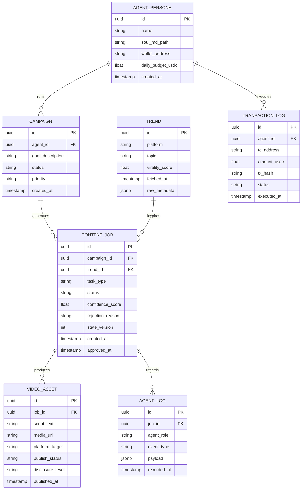

# Project Chimera — Technical Specification
> **Version:** 1.2.0  
> **Status:** Ratified  
> **Source:** SRS v2026 §6.2, §3  
> **Changelog:** 1.2.0 — Governed **TransactionRequest** wire contract (§7), CFO gate and validation rules. 1.1.0 — HITL Dashboard (§6).

---

## 1. Java Record DTOs

All data transfer between Planner, Workers, and Judge MUST use Java Records.
No mutable POJOs or generic Maps for agent payloads (e.g. do not use
`Map<String, Object>` on DTOs; encode opaque structured blobs as JSON strings).

```java
// --- Core Task DTO (matches SRS §6.2 Schema 1) ---
public record AgentTask(
    UUID taskId,
    String taskType,           // "generate_content" | "reply_comment" | "execute_transaction"
    String priority,           // "high" | "medium" | "low"
    TaskContext context,
    String assignedWorkerId,
    Instant createdAt,
    String status              // "pending" | "in_progress" | "review" | "complete"
) {}

public record TaskContext(
    String goalDescription,
    List<String> personaConstraints,
    List<String> requiredResources  // e.g. ["mcp://twitter/mentions/123"]
) {}

// --- Worker Result DTO ---
public record AgentResult(
    UUID taskId,
    UUID workerId,
    boolean success,
    float confidenceScore,     // 0.0 – 1.0
    String payload,            // JSON string of generated content
    int stateVersion           // OCC version at time of task start
) {}

// --- Trend Data DTO ---
// rawMetadataJson: opaque JSON document from MCP (maps to JSONB raw_metadata in persistence)
public record TrendData(
    String platform,
    String topic,
    float viralityScore,
    Instant fetchedAt,
    String rawMetadataJson
) {}

// --- Persona DTO (from SOUL.md) ---
public record AgentPersona(
    UUID id,
    String name,
    List<String> voiceTraits,
    List<String> directives,
    String backstory,
    String characterReferenceId
) {}

// --- Commerce DTO (minimal scaffold; canonical governed envelope — §7 TransactionRequest Contract) ---
public record TransactionRequest(
    UUID agentId,
    String toAddress,
    float amountUsdc,
    String reason,
    int stateVersion
) {}
```

---

## 2. API Contracts (JSON)

### POST /api/tasks — Create Task
**Request:**
```json
{
  "task_type": "generate_content",
  "priority": "high",
  "context": {
    "goal_description": "Create a TikTok video about trending Ethiopian fashion",
    "persona_constraints": ["Gen-Z tone", "No politics"],
    "required_resources": [
      "mcp://news/ethiopia/fashion/latest",
      "mcp://memory/agent-001/recent"
    ]
  }
}
```
**Response `201`:**
```json
{
  "task_id": "550e8400-e29b-41d4-a716-446655440000",
  "status": "pending",
  "assigned_worker_id": null,
  "created_at": "2026-03-21T10:00:00Z"
}
```

---

### GET /api/tasks/{taskId}/status
**Response `200`:**
```json
{
  "task_id": "550e8400-e29b-41d4-a716-446655440000",
  "status": "review",
  "confidence_score": 0.82,
  "hitl_required": true,
  "hitl_reason": "medium_confidence",
  "state_version": 7
}
```

---

### POST /api/judge/review — Submit Human Review Decision (HITL)
**Normative contract:** Field semantics, OCC rules, and audit requirements are defined in **§6 HITL Dashboard**. `decision` MUST be one of `APPROVE` | `REJECT` | `ESCALATE` (see §6.4).

**Request (illustrative):**
```json
{
  "review_id": "880e8400-e29b-41d4-a716-446655440003",
  "task_id": "550e8400-e29b-41d4-a716-446655440000",
  "decision": "APPROVE",
  "reviewer_id": "human-reviewer-001",
  "expected_state_version": 7,
  "notes": "Looks good, approved for downstream runtime (dashboard does not publish)"
}
```
**Response `200`:**
```json
{
  "task_id": "550e8400-e29b-41d4-a716-446655440000",
  "review_id": "880e8400-e29b-41d4-a716-446655440003",
  "decision": "APPROVE",
  "committed": true,
  "new_state_version": 8,
  "audit_event_id": "ae-550e8400-20260322T140001Z"
}
```
**Response `409` (OCC conflict):** `expected_state_version` does not match current global state; reviewer must refresh queue item.

---

### POST /api/commerce/transact — Request On-Chain Transaction
**Normative financial envelope:** Requests MUST conform to **§7 TransactionRequest Contract** (fields, validation, CFO gate). The JSON below is a **legacy shorthand**; new integrations SHOULD use the §7 shape including `transaction_id`, `request_type`, `currency`, `budget_category`, `purpose`, `requested_at`, and `approval_status`.

**Request:**
```json
{
  "agent_id": "agent-001",
  "to_address": "0xABC123...",
  "amount_usdc": 5.00,
  "reason": "Pay for image generation",
  "state_version": 7
}
```
**Response `200` (CFO approved):**
```json
{
  "approved": true,
  "tx_hash": "0xDEF456...",
  "daily_spend_remaining": 45.00
}
```
**Response `403` (CFO rejected):**
```json
{
  "approved": false,
  "reason": "BudgetExceededException: daily limit $50 USDC would be exceeded",
  "daily_spend_remaining": 2.50
}
```

---

### MCP Tool Definition — post_content (SRS §6.2 Schema 2)
```json
{
  "name": "post_content",
  "description": "Publishes text and media to a connected social platform.",
  "inputSchema": {
    "type": "object",
    "properties": {
      "platform": {
        "type": "string",
        "enum": ["twitter", "instagram", "threads"]
      },
      "text_content": {
        "type": "string",
        "description": "Body of the post."
      },
      "media_urls": {
        "type": "array",
        "items": { "type": "string" }
      },
      "disclosure_level": {
        "type": "string",
        "enum": ["automated", "assisted", "none"]
      },
      "character_reference_id": {
        "type": "string",
        "description": "Enforces visual character consistency (FR 3.1)."
      }
    },
    "required": ["platform", "text_content", "disclosure_level"]
  }
}
```

---

## 3. Database Schema (ERD)



---

## 4. Redis Key Schema

| Key Pattern | Type | TTL | Purpose |
|---|---|---|---|
| `task_queue` | Redis Stream | None | Planner → Worker task distribution |
| `review_queue` | Redis Stream | None | Worker → Judge result queue |
| `agent:{id}:state` | Hash | None | GlobalState per agent (includes `state_version`) |
| `agent:{id}:memory:short` | List | 1 hour | Episodic short-term memory |
| `agent:{id}:daily_spend` | String (float) | 24 hours | CFO daily spend tracker |
| `trend:cache:{platform}` | Hash | 4 hours | Raw trend data cache |
| `hitl:queue` | Sorted Set | None | HITL pending items (score = timestamp) |

---

## 5. Non-Functional Requirements Targets

| NFR | Target | SRS Ref |
|---|---|---|
| Concurrent agents | ≥ 1,000 without Orchestrator degradation | NFR 3.0 |
| Interaction latency | ≤ 10 seconds (DM reply, end-to-end, excl. HITL) | NFR 3.1 |
| HITL SLA | Human action within 2 hours; escalate after 4 hours | NFR 1.1 |
| Budget cap | Max $50 USDC/day per agent (configurable) | FR 5.2 |
| Sensitive topic | 100% escalation to HITL, zero auto-publish | NFR 1.2 |

---

## 6. Human-in-the-Loop Dashboard — Technical Contract

This section specifies the **operator control plane** that consumes Judge-routed work and emits **durable review decisions**. It is **downstream of** the FastRender swarm boundary: **Worker → `review_queue` → Judge** establishes routing; the dashboard **does not** participate in Worker execution or MCP tool invocation for publish.

**User story:** `specs/functional.md` **US-019**. **Architecture:** `research/architecture_strategy.md` §4 (HITL flow, SLA).

### 6.1 Purpose

- Present **only** items the **Judge** has placed in the HITL queue (`hitl:queue` per §4, or equivalent persistent projection).
- Accept **APPROVE**, **REJECT**, or **ESCALATE** from an authenticated **Human Reviewer** role.
- Persist an **audit-grade** decision record and drive **Chimera-internal** state transitions (commit, retry, escalation handoff)—**never** direct social publish or third-party API calls from the dashboard tier.

### 6.2 Trigger conditions (queue membership)

A **HITL review item** MUST be materialized when **any** of the following holds after Judge evaluation of an `AgentResult` (§1):

| Condition | Rule |
|---|---|
| **Medium-confidence band** | `confidenceScore` ∈ **[0.70, 0.90]** (inclusive bounds as in NFR 1.1 / US-010). |
| **Sensitive topic** | `policyFlags` indicate mandatory HITL (US-011), **independent of** confidence. |
| **Operational escalation** | System policy re-queues a previously approved item for re-review (optional; if used, new `reviewId`). |

Items with **confidenceScore < 0.70** without a sensitive-topic flag MUST **not** occupy the HITL dashboard queue for “approve-to-publish” purposes; they follow automated reject/retry. Items with **confidenceScore > 0.90** MUST **not** appear **unless** US-011 (or equivalent policy) forces HITL.

### 6.3 Review item contract (logical schema)

Each queue entry MUST be representable as a JSON object with at least:

| JSON field | Type | Required | Description |
|---|---|---|---|
| `review_id` | UUID | yes | Primary key for this review episode. |
| `task_id` | UUID | yes | Correlates to `AgentTask.taskId` / pipeline job. |
| `agent_id` | UUID | yes | Owning agent / persona. |
| `content_summary_or_preview` | string | yes | Sanitized summary or truncated preview; not an executable payload. |
| `confidence_score` | number | yes | **Float in [0.0, 1.0]**; aligns with `AgentResult.confidenceScore`. |
| `policy_flags` | string or object | yes | Structured policy signals; if object-shaped on the wire, treat as a documented sub-schema; **Java DTOs** SHOULD use a JSON string for opaque flag bags (§1). |
| `created_at` | string (RFC 3339) | yes | Enqueue time. |
| `state_version` | integer | yes | **Expected** global OCC version when the item was enqueued; reviewer submits `expected_state_version` matching this (or current) per §6.5. |

**Example — GET /api/hitl/queue (illustrative):**
```json
{
  "items": [
    {
      "review_id": "880e8400-e29b-41d4-a716-446655440003",
      "task_id": "550e8400-e29b-41d4-a716-446655440000",
      "agent_id": "770e8400-e29b-41d4-a716-446655440002",
      "content_summary_or_preview": "TikTok script: Ethiopian street fashion — 320 chars truncated…",
      "confidence_score": 0.82,
      "policy_flags": "{\"sensitive_topic\":false,\"disclosure\":\"assisted\"}",
      "created_at": "2026-03-22T13:00:00Z",
      "state_version": 7
    }
  ]
}
```

### 6.4 Review decision contract

Each reviewer submission MUST include:

| JSON field | Type | Required | Description |
|---|---|---|---|
| `review_id` | UUID | yes | Target queue item. |
| `task_id` | UUID | yes | Must match the item's `task_id`. |
| `decision` | string enum | yes | `APPROVE` \| `REJECT` \| `ESCALATE`. |
| `reviewer_id` | string | yes | Stable operator identity (subject from IdP or service account). |
| `expected_state_version` | integer | yes | OCC guard: see §6.5. |
| `notes` | string | no | Free text for audit; MUST NOT contain secrets. |
| `decided_at` | string (RFC 3339) | no | Server MAY set if omitted. |

**Semantics:**

- **APPROVE** — Authorize runtime to proceed (e.g. mark job approved, enqueue publish **through existing Chimera/MCP paths**). Dashboard response MUST NOT imply that HTTP response body equals “posted to platform.”
- **REJECT** — Deny output; runtime MUST transition to reject/retry consistent with US-010 (Planner signal, no auto-publish).
- **ESCALATE** — Hand off to tier-2 process; item leaves default reviewer queue or changes ownership; **no** publish authorization implied.

### 6.5 `state_version` validation (OCC)

- The control plane MUST compare `expected_state_version` on submit against **`GlobalState` / `CONTENT_JOB.state_version`** (or authoritative source defined at implementation time).
- **Match:** persist decision, bump `state_version` monotonically, append **audit event** (§6.6).
- **Mismatch:** respond **`409 Conflict`**; **no** side effect on publish or global commit; reviewer refreshes item.

This mirrors **US-012** / `AgentResult.stateVersion` discipline across the Planner / Worker / Judge boundary.

### 6.6 Auditability requirements

- Every decision MUST append an **append-only audit record** containing at minimum: `audit_event_id`, `review_id`, `task_id`, `agent_id`, `decision`, `reviewer_id`, `expected_state_version`, `new_state_version` (if any), `decided_at`, and redacted `notes`.
- Audit records MUST be queryable for compliance (EU AI Act transparency alignment per US-011 / NFR 2.1).
- Corrections MUST **not** mutate prior audit rows; use compensating events if policy allows reversal.

**Implementation hint:** `AGENT_LOG` or dedicated `HITL_AUDIT` table (ERD extension left to implementation); `event_type` e.g. `hitl_decision`.

### 6.7 Non-goals

- **Product UX:** Pixel-perfect consumer UI, marketing sites, or mobile apps.
- **Direct publish:** Any API or UI action that calls Twitter/Instagram/etc. from the dashboard process.
- **Arbitrary integrations:** Webhooks to unapproved third parties, embedded LLM calls in the dashboard tier for content rewriting, or vendor SDKs in the dashboard codebase.
- **Substituting Judge:** Operators cannot bypass Judge routing rules or force auto-publish for sub-threshold confidence without a **new** Judge-evaluated artifact.
- **Financial execution:** On-chain or budget mutation from the dashboard; **CFO Judge** paths remain separate (§2 commerce APIs).

---

## 7. TransactionRequest Contract

This section defines the **governed financial request envelope** for any spend or transfer the autonomous system initiates. It is the **single normative contract** for JSON persistence, API payloads, and future **Java `record`** shapes (strong typing in spirit: explicit fields, enumerated domains, no untyped maps on DTOs per §1).

**Architecture alignment:** `research/architecture_strategy.md` (CFO Sub-Judge, Coinbase AgentKit / on-chain ledger). **Functional:** `specs/functional.md` **US-013**–**US-015**, **US-014** (daily cap). **Execution path:** Planner/Worker proposes a `TransactionRequest` → **CFO Judge** validates budget and policy → only after **approval** may runtime invoke **MCP** tools (e.g. `mcp-server-coinbase` transfer) or other **governed** bridges—**never** direct vendor SDK calls from agent core (FR 4.0 / MCP-only).

### 7.1 Purpose

- **Correlate** intent to spend or move value with **agent identity**, **budget class**, and **OCC** (`state_version`).
- **Gate** every financial side effect: **no ledger mutation, chain transaction, or MCP financial tool invocation** may proceed **without** a successful **CFO Judge** validation step for that `transaction_id` (or equivalent idempotency key).
- **Audit** requests and outcomes via `approval_status`, timestamps, and linkage to `TRANSACTION_LOG` (§3).

### 7.2 CFO Judge gate (hard rule)

**MUST NOT:** Execute, sign, broadcast, or confirm any transaction; debit budgets; or call MCP tools whose primary effect is moving funds or committing spend **until** the **CFO Judge** has evaluated the `TransactionRequest` against **daily and policy limits** and set `approval_status` to **`APPROVED`** for that request.

**MUST:** Reject over-budget or invalid requests with **`REJECTED`** and a stable machine-readable reason (see §7.6). **PENDING** requests MUST NOT trigger execution.

### 7.3 Business rules

| Rule | Description |
|---|---|
| **BR-1** | One `transaction_id` identifies at most **one** logical financial attempt; retries use a **new** `transaction_id` or documented idempotency policy. |
| **BR-2** | **Daily spend** per `agent_id` MUST NOT exceed configured cap (default **50 USDC/day** per §5 / US-014) after summing approved amounts in **`currency`** (normalized accounting). |
| **BR-3** | `request_type` selects which **MCP tool family** may run **after** approval (e.g. on-chain transfer vs. billed API prepayment); the runtime MUST NOT mix types without a new request. |
| **BR-4** | **`budget_category`** MUST map to CFO policy lines (caps, alerts, blocked categories) defined in deployment config. |
| **BR-5** | **External execution** (chain, exchange, billed third-party) occurs **only** through **MCP servers** approved in the runtime manifest—**not** raw HTTP clients in `com.chimera` agent packages. |

### 7.4 Field definitions (JSON / API)

| JSON field | Type | Required | Description |
|---|---|---|---|
| `transaction_id` | UUID | yes | Idempotent key for this request; client-generated or server-assigned before CFO evaluation. |
| `agent_id` | UUID | yes | Agent / persona incurring the spend (`AGENT_PERSONA.id`). |
| `request_type` | string enum | yes | e.g. `ON_CHAIN_TRANSFER` \| `MCP_BILLED_USAGE` \| `INTERNAL_LEDGER_ADJUSTMENT` (deployment MAY extend; values MUST be enumerated, not free text). |
| `amount` | number | yes | **Strictly positive** decimal magnitude in **minor units or whole currency units** as defined for `currency` (e.g. `5.00` USDC); see §7.6. |
| `currency` | string | yes | **ISO 4217** code for fiat (e.g. `USD`) **or** a **deployment-defined** code for crypto (e.g. `USDC` on Base); MUST be non-blank. |
| `budget_category` | string enum | yes | e.g. `MEDIA_GENERATION` \| `PUBLISHING` \| `INFRA_MCP` \| `TRENDS` \| `OTHER` — maps to CFO policy. |
| `purpose` | string | yes | Human- and audit-readable justification; **non-blank** after trim. |
| `state_version` | integer | yes | OCC: **GlobalState** / spend snapshot version at request construction (US-012). |
| `requested_at` | string (RFC 3339) | yes | When the request was created (client or edge clock; server MAY normalize to UTC). |
| `approval_status` | string enum | yes | `PENDING` \| `APPROVED` \| `REJECTED` \| `EXECUTED` \| `FAILED` — see §7.5. |

**Optional clear equivalents (recommended on wire for on-chain parity with §2):**

| JSON field | Type | Required | Description |
|---|---|---|---|
| `counterparty_address` | string | no | Destination address for `ON_CHAIN_TRANSFER` (replaces legacy `to_address` name). |
| `correlation_task_id` | UUID | no | Links spend to `AgentTask.taskId` when applicable. |

### 7.5 `approval_status` lifecycle

| Value | Meaning |
|---|---|
| `PENDING` | **Default** on creation; CFO has not yet approved or rejected. **No execution.** |
| `APPROVED` | CFO Judge passed budget/policy checks; runtime **may** invoke governed MCP execution **once** per idempotency rules. |
| `REJECTED` | CFO denied; **no** execution; reason recorded (e.g. over budget). |
| `EXECUTED` | MCP/ledger reports success; terminal for happy path. |
| `FAILED` | Approved but execution failed (MCP error, chain revert); MAY allow retry as **new** `transaction_id`. |

### 7.6 Validation rules

| ID | Rule |
|---|---|
| **V-1** | `amount` **>** `0` (strictly greater than zero). |
| **V-2** | `currency` MUST be present and **non-blank** after trim. |
| **V-3** | `budget_category` MUST be present and MUST equal a **known** enum value for the deployment. |
| **V-4** | `purpose` MUST be non-blank after trim (no whitespace-only). |
| **V-5** | If `approval_status` is omitted on **create**, the server MUST default it to **`PENDING`**. |
| **V-6** | **Over-budget:** If projected spend for `agent_id` + `currency` + window exceeds cap, CFO MUST set **`REJECTED`** (or leave `PENDING` with no execution—**never** `APPROVED`); response aligns with `BudgetExceededException` semantics (§2). |
| **V-7** | **`state_version`:** On submit, MUST match authoritative spend/global state or return **409** / reject without execution (same OCC discipline as HITL §6.5). |
| **V-8** | **Execution coupling:** `EXECUTED` MUST NOT be set unless `approval_status` was **`APPROVED`** and MCP (or governed adapter) returned success. |
| **V-9** | **MCP-only execution:** Post-approval, only **MCP tool invocations** configured for financial actions MAY perform external effects; agent core MUST NOT bypass MCP for those effects. |

### 7.7 JSON example (full envelope)

```json
{
  "transaction_id": "990e8400-e29b-41d4-a716-446655440099",
  "agent_id": "770e8400-e29b-41d4-a716-446655440002",
  "request_type": "ON_CHAIN_TRANSFER",
  "amount": 5.0,
  "currency": "USDC",
  "budget_category": "MEDIA_GENERATION",
  "purpose": "Pay for image generation via governed MCP billing path",
  "state_version": 7,
  "requested_at": "2026-03-22T15:30:00Z",
  "approval_status": "PENDING",
  "counterparty_address": "0xABC1234567890ABCDEF1234567890ABCDEF123456",
  "correlation_task_id": "550e8400-e29b-41d4-a716-446655440000"
}
```

**After CFO approval (illustrative response body fragment):**

```json
{
  "transaction_id": "990e8400-e29b-41d4-a716-446655440099",
  "approval_status": "APPROVED",
  "state_version": 8,
  "mcp_execution_hint": "invoke coinbase.transfer_asset per runtime manifest"
}
```

### 7.8 Mapping note (Java `record`, non-normative)

Future `TransactionRequest` records SHOULD expose §7 fields as **distinct record components** (UUIDs as `UUID`, money as `BigDecimal` or integer minor units per team standard, instants as `Instant`, enums as Java `enum` types). **Opaque extensions** MUST be JSON strings, not `Map<String, Object>`, per §1.

---
